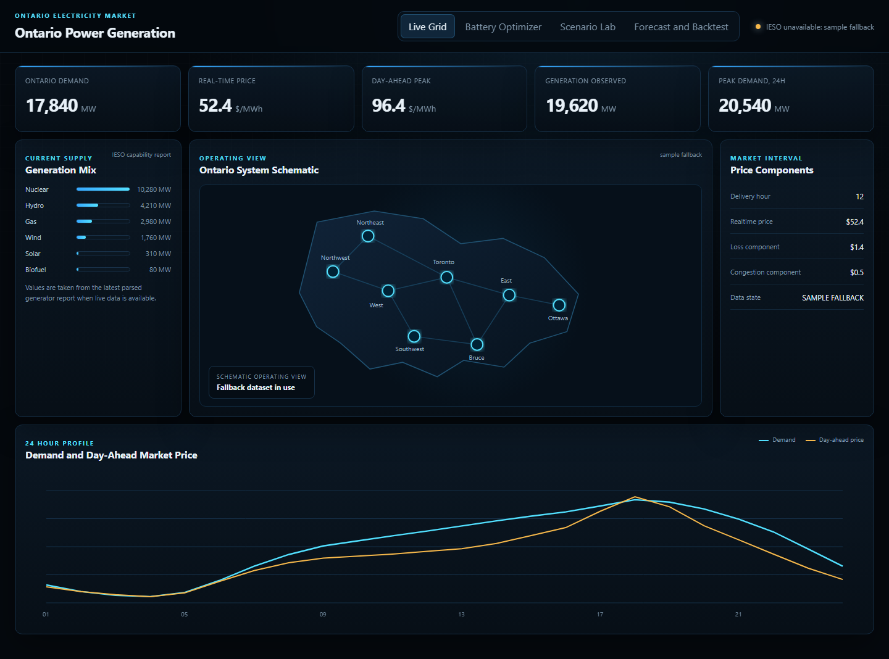
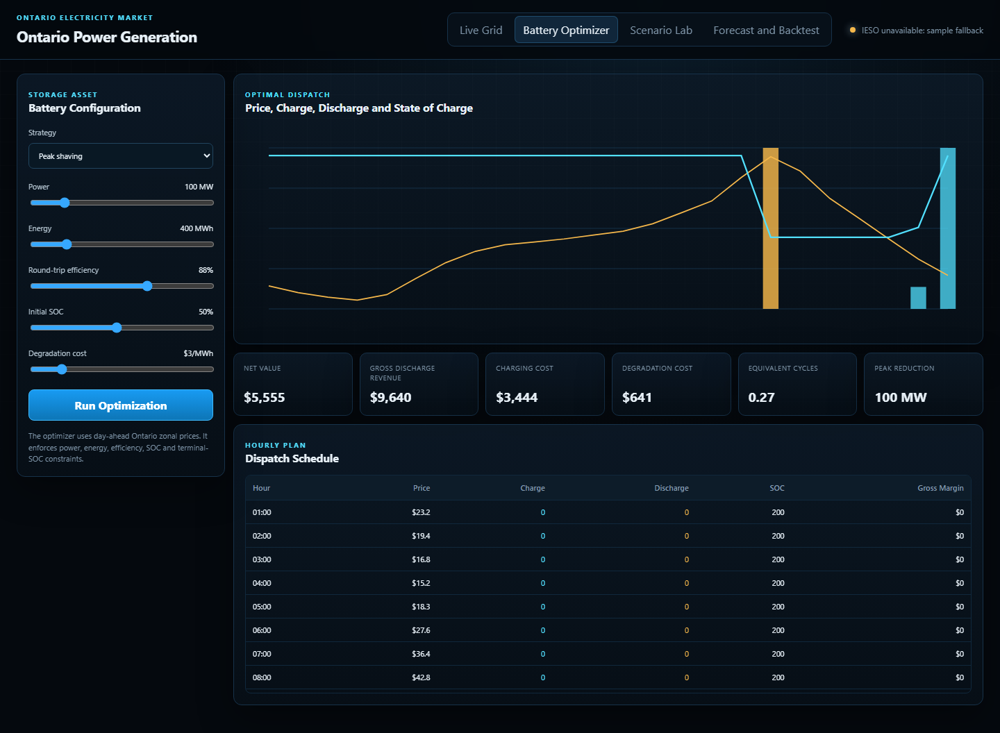
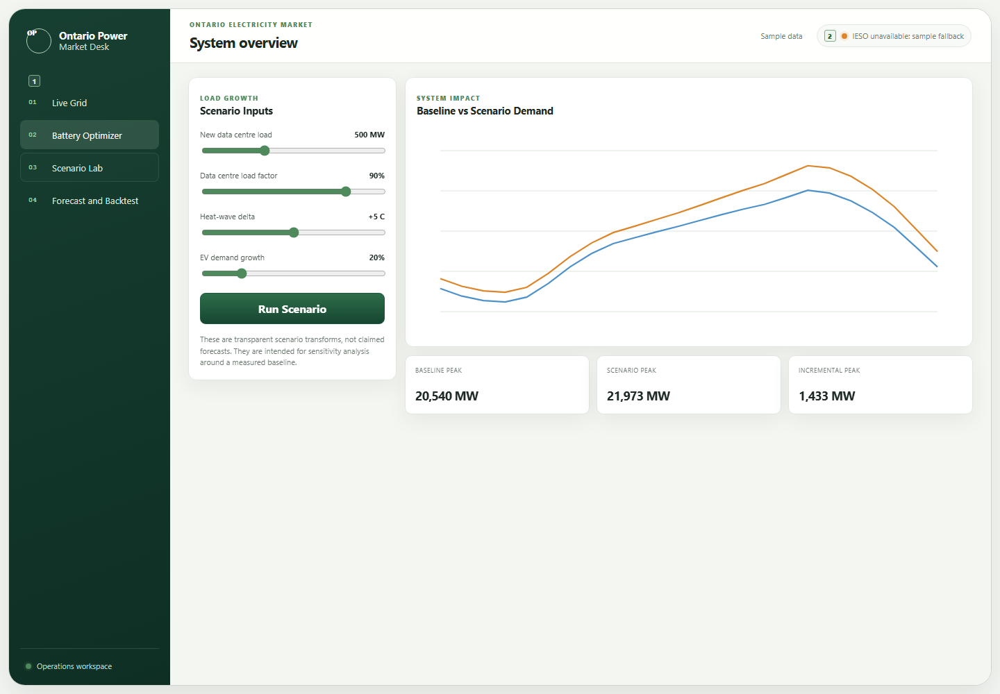

# Ontario Power Generation

Ontario Power Generation is a public-data electricity-market intelligence, forecasting and battery-storage optimization application built around official IESO reports.

The name describes the project subject. This repository is not affiliated with Ontario Power Generation Inc. or the Independent Electricity System Operator.

## What the application does

### Live Grid

The backend retrieves and normalizes current IESO public reports for:

- Ontario hourly demand
- Ontario zonal real-time price
- day-ahead Ontario zonal price
- generator output and capability
- hourly zonal demand where available

The UI clearly reports whether the current session is using live IESO data or the bundled sample fallback.

### Battery Optimizer

A constrained linear program calculates an hourly charge and discharge schedule using the day-ahead price curve.

Constraints include power, energy capacity, minimum and maximum state of charge, round-trip efficiency, terminal state of charge and degradation cost.

Two strategies are implemented:

- market-value arbitrage
- system peak shaving

### Scenario Lab

The scenario lab lets an analyst layer explicit sensitivity assumptions over the measured 24-hour demand baseline:

- new data-centre load
- data-centre load factor
- heat-wave temperature delta
- EV demand growth

These are labelled scenario transforms and are not presented as forecasts.

### Demand Forecast and Backtest

The repository includes a reproducible pipeline for downloading official IESO hourly demand history and training a gradient-boosting model with a chronological holdout.

The model uses hour, weekday, month, 1-hour lag, 24-hour lag, 168-hour lag and rolling demand features.

No invented model score is shipped. Metrics are generated after training and compared with a one-week seasonal-naive baseline.

## Public data foundation

IESO publishes the core data required for the product:

- Data Directory: https://www.ieso.ca/power-data/data-directory
- Hourly Demand: https://reports-public.ieso.ca/public/Demand/
- Real-Time Ontario Zonal Price: https://reports-public.ieso.ca/public/RealtimeOntarioZonalPrice/
- Day-Ahead Ontario Zonal Price: https://reports-public.ieso.ca/public/DAHourlyOntarioZonalPrice/
- Generator Output and Capability: https://reports-public.ieso.ca/public/GenOutputCapability/
- Hourly Consumption by Forward Sortation Area: https://reports-public.ieso.ca/public/HourlyConsumptionByFSA/
- 2026 Annual Planning Outlook: https://www.ieso.ca/Sector-Participants/Planning-and-Forecasting/Annual-Planning-Outlook

The IESO FSA consumption archive provides an additional path for geographic demand modelling but is not bundled into the repository because the monthly archives are large.

## Run locally

```bash
python -m venv .venv
source .venv/bin/activate
pip install -e ".[dev]"
uvicorn app.main:app --reload --port 8000
```

On Windows:

```powershell
.venv\Scripts\Activate.ps1
pip install -e ".[dev]"
uvicorn app.main:app --reload --port 8000
```

Open:

```text
http://localhost:8000
```

## Train the demand model

```bash
python scripts/download_ieso_history.py --start-year 2018 --end-year 2025
python scripts/train_demand_model.py
```

Downloaded market data and model artifacts are gitignored.

## Test locally

```bash
python -m pytest -q
python scripts/check_no_emoji.py
```

### Browser end-to-end tests

The Playwright suite exercises the dashboard through a real browser: live-grid rendering, battery peak-shaving, scenario inputs, forecast content and the mobile layout. It serves the bundled market snapshot to the browser for the live-feed request, so results are deterministic; optimizer and scenario calls continue through the running FastAPI service.

Start the application in one terminal:

```bash
uvicorn app.main:app --port 8000
```

Then, in another terminal, install Chromium once and run the suite:

```bash
python -m playwright install chromium
python -m pytest tests/test_browser_e2e.py -q
```

If the app is on another port, set `E2E_BASE_URL` first. For example, in PowerShell:

```powershell
$env:E2E_BASE_URL = "http://127.0.0.1:8010"
python -m pytest tests/test_browser_e2e.py -q
```

## Using the dashboard

1. **Live Grid** opens the latest available IESO market snapshot. Check the source chip in the upper-right: it distinguishes live IESO reports from the clearly labelled bundled fallback.
2. **Battery Optimizer** lets you choose market-value arbitrage or peak shaving, set the battery power, energy, efficiency, initial state of charge and degradation cost, then select **Run Optimization**. The result cards and hourly dispatch schedule update together.
3. **Scenario Lab** applies the chosen data-centre load, load factor, heat-wave and EV-growth assumptions to the measured 24-hour baseline. These are sensitivity transforms, not a forecast.
4. **Forecast and Backtest** documents the reproducible history-download and forward-validation workflow. Run the two scripts shown there when you want to train against downloaded IESO history.

## Dashboard screenshots

The screenshots below were captured through the Playwright browser workflow using the bundled fallback snapshot, which is why the source chip is amber rather than live green.

### Live Grid



### Battery Optimizer



### Scenario Lab



There is intentionally no GitHub Actions, CI or deployment workflow in this repository.

## Model boundary

This is an analytics and product-development project. It does not reproduce IESO market clearing or transmission security analysis. Public reports do not contain every bid, offer, transmission state, protection constraint or confidential participant input required for an exact grid digital twin.

The battery optimizer is a deterministic planning model built from public price and load data. Scenario assumptions are explicit. Forecast claims should only be made after the training pipeline is run and evaluated.
