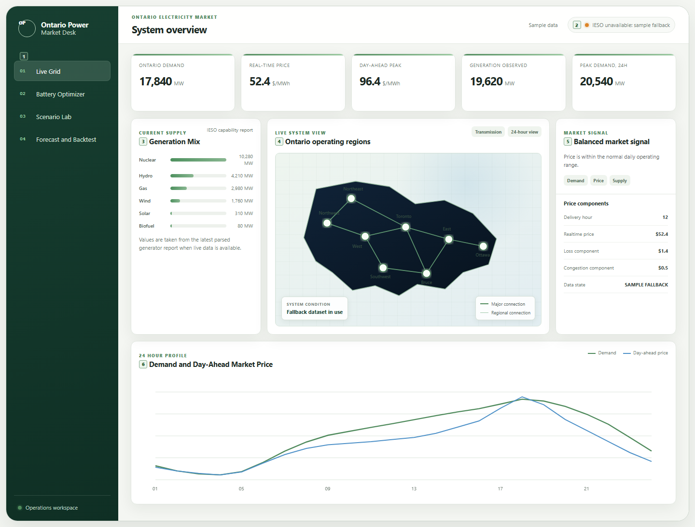

# Ontario Power Generation

This repository reads public IESO market reports, normalizes the latest operating snapshot, solves battery dispatch as a constrained linear program and applies explicit demand-sensitivity scenarios to the measured load profile. A separate training pipeline builds a chronological Ontario demand forecast from downloaded IESO history.

The repository name refers to Ontario electricity generation as the project subject. It is not affiliated with Ontario Power Generation Inc. or the Independent Electricity System Operator.

## Interface

### Live Grid



The numbered regions identify the operating surfaces in the live-grid view:

1. **Workspace navigation** switches between Live Grid, Battery Optimizer, Scenario Lab and Forecast/Backtest without changing the underlying data session.
2. **Source state** reports whether the current snapshot came from live IESO public reports or the bundled fallback dataset. The timestamp and source state should be checked before interpreting the dashboard.
3. **Generation mix** groups the latest reported generator output by fuel type and compares the contribution of the major supply classes.
4. **Ontario operating-region view** provides geographic context for the current session and distinguishes the major regional connections shown by the schematic.
5. **Market signal** compares the current real-time price with the day-ahead price profile and classifies the current interval as a charging, balanced or elevated-price window. It is a rule-based operating cue rather than a price forecast.
6. **Demand and price profile** plots the 24-hour Ontario demand series with the day-ahead price curve so load shape and storage-value periods can be inspected on the same time axis.

### Battery Optimizer


The optimizer view exposes four functional groups: battery constraints, strategy selection, objective outputs and the hourly dispatch schedule. Battery constraints include power, energy capacity, round-trip efficiency, initial state of charge, minimum and maximum state of charge, terminal state of charge and degradation cost. Strategy selection switches between market-value arbitrage and system peak shaving. The result cards report the solved objective and battery-use metrics while the hourly schedule shows charge, discharge and state of charge for every interval.

### Scenario Lab


The scenario view applies explicit transforms to the observed 24-hour baseline. Inputs cover incremental data-centre load, data-centre load factor, temperature sensitivity for a heat-wave case and EV-demand growth. The result compares the transformed load profile with the measured baseline. These values are scenario assumptions and are not forecast outputs.

## IESO data

The backend normalizes the following public IESO reports when they are available:

- Ontario hourly demand
- real-time Ontario zonal price
- day-ahead Ontario zonal price
- generator output and capability
- hourly zonal demand where the source report is available

The UI reports whether the active session is using live IESO data or the bundled fallback snapshot. Source failures do not silently become live observations.

Official sources:

**IESO Data Directory**  
https://www.ieso.ca/power-data/data-directory

**Hourly Demand**  
https://reports-public.ieso.ca/public/Demand/

**Real-Time Ontario Zonal Price**  
https://reports-public.ieso.ca/public/RealtimeOntarioZonalPrice/

**Day-Ahead Ontario Zonal Price**  
https://reports-public.ieso.ca/public/DAHourlyOntarioZonalPrice/

**Generator Output and Capability**  
https://reports-public.ieso.ca/public/GenOutputCapability/

**Hourly Consumption by Forward Sortation Area**  
https://reports-public.ieso.ca/public/HourlyConsumptionByFSA/

**IESO Annual Planning Outlook**  
https://www.ieso.ca/Sector-Participants/Planning-and-Forecasting/Annual-Planning-Outlook

The FSA consumption archive can support geographic demand analysis but is not bundled because the source archives are large.

## Battery model

The battery optimizer is a deterministic linear program over hourly intervals. Decision variables represent charging, discharging and state of charge. Constraints enforce battery power, usable energy, state-of-charge bounds, charge/discharge efficiency and the requested terminal state.

The arbitrage objective maximizes market value net of degradation cost using the supplied price curve. The peak-shaving objective reduces the highest net-demand intervals subject to the same physical constraints. The implementation does not model IESO bids, dispatch instructions, transmission constraints or ancillary-service qualification.

## Scenario model

Scenario Lab starts from the measured load profile and applies the selected sensitivity parameters. Data-centre load is controlled separately from its load factor. Heat-wave sensitivity modifies load according to the explicit temperature-delta assumption. EV growth adds the configured demand increment. Because the inputs are transparent transforms, baseline and scenario values can be compared without implying that the scenario is statistically forecast.

## Demand forecast

The training pipeline downloads official IESO hourly demand history and creates calendar, lag and rolling features. Current features include hour, weekday, month, 1-hour lag, 24-hour lag, 168-hour lag and rolling demand statistics. Training uses a chronological holdout rather than a random split so future observations do not leak into model fitting.

No precomputed accuracy claim is hard-coded in the repository. Training writes model metrics and compares the fitted model with a one-week seasonal-naive baseline.

```bash
python scripts/download_ieso_history.py --start-year 2018 --end-year 2025
python scripts/train_demand_model.py
```

Downloaded history and model artifacts are excluded from Git.

## Run locally

```bash
python -m venv .venv
source .venv/bin/activate
pip install -e ".[dev]"
uvicorn app.main:app --reload --port 8000
```

On Windows:

```powershell
.venv\Scripts\Activate.ps1
pip install -e ".[dev]"
uvicorn app.main:app --reload --port 8000
```

Open `http://localhost:8000`.

## Model limits

Public IESO reports do not contain every bid, offer, transmission state, protection constraint or confidential market-participant input required to reproduce market clearing or transmission-security analysis. The battery model is a planning optimizer built from public price and load data. Scenario Lab applies explicit sensitivities rather than forecasts. Demand-forecast performance should only be cited from a completed training and backtest run using the downloaded historical dataset.